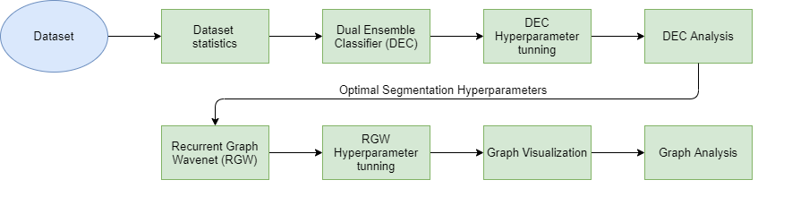
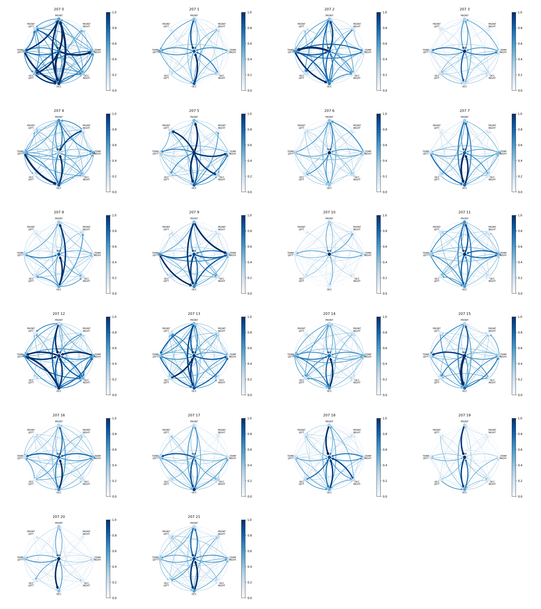

## Project description
The bachelor's licence thesis titled *Learning Dynamic Brain Connectivity from EEG Signals with a Spatial Temporal Graph Convolution approach* has been developed under the supervision of the *Knowledge Engineering Group* of the Technical University of Cluj-Napoca in collaboration with the *The Transylvanian Institute of Neuroscience*.

The purpose of this thesis was the development of an architecture capable of extracting dynamic correlations from multivariate timeseries data, at a self identifiable granularity
level, able to capture meaningful processes that occur during the evolution of the studied
signals. As an additional toolkit, the means of visualizing and analysing the discovered
networks were provided. Moreover, from a Neuroscience perspective, this solution rep-
resents an insight into identifying the cognitive processes that arise in the brain during
visual recognition, providing the method from which the evolutionary functional states of
the brain can be studied.

In the context of the current thesis, the architecture was created for understanding the underlying cognitive processes that occur during the task of **visual recognition**.  Starting from a set of EEG signals recorded on human subjects having the objective of identifying depicted objects, the goal is the generation of a set of Dynamic Networks representing an overview of the evolution of the brain states. The conceptual pipeline of the project can be seen below:

An example of the final results of the tool can be seen below. In the picture, a set of **Dynamic Networks** can be observed, with the nodes representing the brain regions and the edges representing the interactions between the brain regions. The color of the nodes represents the intensity of the activity inside a specific region, whereas the color of the edges represents the intensity of the activity between two brain regions. The networks were extracted from the EEG activity of a human subject recorded during his attempt of visually identifying a depicted object.

For a comprehensive explanation of the entire pipeline, together with additional results please refer to the **Documentation** file.

## Project Requirements
The software requirements needed in order to run the application are:
* Operating system: Window, Linux or MacOS
* Python 3.7
* Git
* A set of python requirements that can be installed by running the following command:
	* **pip install -r project requirements.txt**

Moreover, with respect to the hardware limitations, the minimal hardware requirements for
executing the solution are:
- 4 cores CPU
- 12GB RAM
- 50GB Storage
- 8GB GPU VRAM (optional; the execution can be performed without a GPU)
## Running the project
A wrapper GUI for the entire application has been developed in order to aid the user in easily using this application. In order for an user to start the GUI, it just needs to run the **main_gui.py**.